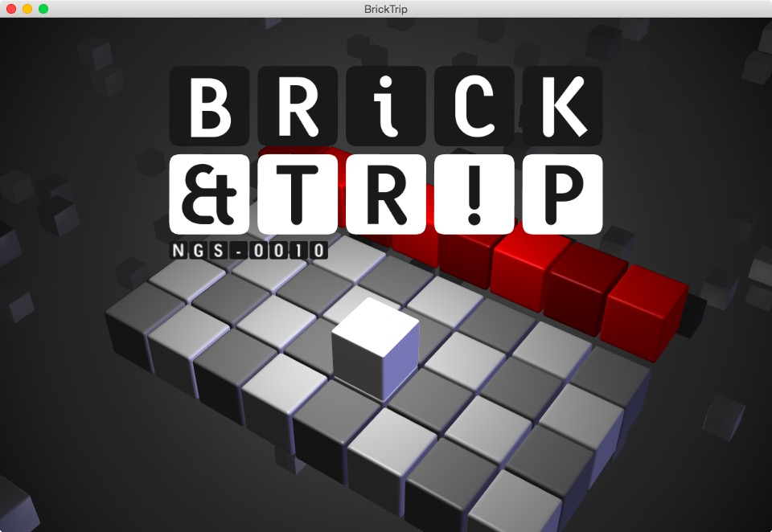
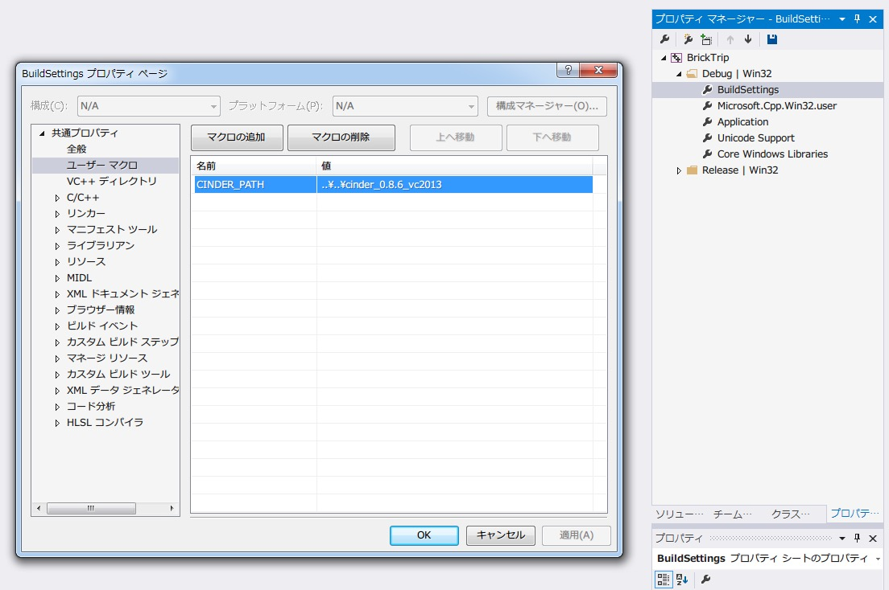
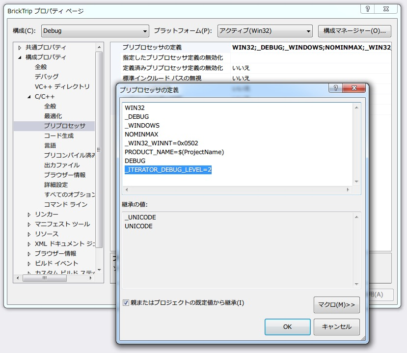
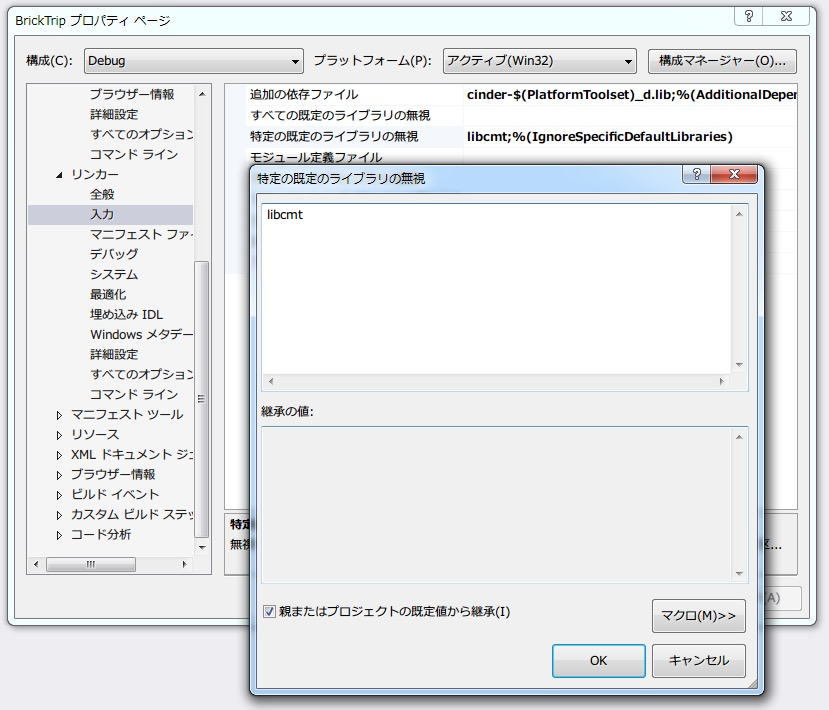

# BRICK&TRIP
拙作アプリ[『BRICK&TRIP』](https://itunes.apple.com/us/app/brick-trip/id1051740912?l=ja&ls=1&mt=8)のソースコード一式

BRICK&TRIPは、[Cinder](http://libcinder.org)を使って開発をおこないました。

+ iOS、OSX、Windowsで動作
+ OpenGLの固定シェーダでの実装
+ iOS固有の機能に対応(GameCenter、SNS投稿)

## How To Build
1. Cinderライブラリ(0.8.6)を[公式サイト](http://libcinder.org)からダウンロード。ライブラリが格納されているフォルダをプロジェクトと同じ場所に置く

1. FreeTypeライブラリ(2.6.3)のソースファイルを[公式サイト](http://www.freetype.org)からダウンロードしてビルド。includeファイルとライブラリファイルを、Cinderライブラリのinclude、libへそれぞれコピー

1. paramsフォルダ内の.jsonファイルをすべてassetsフォルダへコピー

1. プロジェクトファイルを開く

1. プロジェクト内で設定されているCinderライブラリのパスを変更

   1. **OSX,iOS:** Build Settingsの一番下で環境変数CINDER_PATHを定義しています
   1. **Windows:** プロパティシート内ユーザーマクロでCINDER_PATHを定義しています
   
	  

1. Windows版で必要な修正

   1. プロジェクトのプロパティ内、Debug構成での「構成プロパティ→C/C++→プリプロセッサ→プリプロセッサの定義」にて「_ITERATOR_DEBUG_LEVEL」の定義を削除

      

   1. 同じく「構成プロパティ→リンカー→入力→特定の既定のライブラリの無視」にlibcmtを追加

      

1. Let's enjoy!!

### 注意
+ Windows版

  **VisualStudio2015** 必須。それ以外のバージョンではビルドできません。

+ OSX

  **Xcode7以降** 必須。それより前のバージョンではビルドできません。

+ iOS版

  **Xcode7以降** 必須。それより前のバージョンではビルドできません。

  公式サイトで配布されているソースに少し手を加えた為、そのままではビルドが通りません。いい感じに修正してください:D

## License
License All source code files are licensed under the MPLv2.0 license

[MPLv2.0](https://www.mozilla.org/MPL/2.0/)
